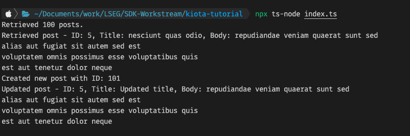

# About
This repository is my learning for Microsoft Kiota. I am using this repository to learn how to use Kiota to generate code.

It used OpenAPI file `posts-api.yml` to generate the API SDK/Client(?) located in ./client directory which is consumed by `index.ts` file.

## Steps of setting up
1. Install the [VSCode extension Kiota generator](https://marketplace.visualstudio.com/items?itemName=ms-graph.kiota)
2. Follow this tutorial [Build API clients for Typescript](https://learn.microsoft.com/en-gb/openapi/kiota/quickstarts/typescript)
   > Instead of running kiota CLI, I ran the VSCode extension (Kiota - Open API Description) with the following parameters:
    > - `name for the client class` - PostsClient
    > - `name for the client class namespace` - PostsSDK
    > - `folder` - ./client
    > - `Language` - Typescript
3. Create the `index.ts` file as instructed in the tutorial. As long as putting in the same parameters as above, it should work
4. Results

## Notes
1. Generated files are in the `./client` folder